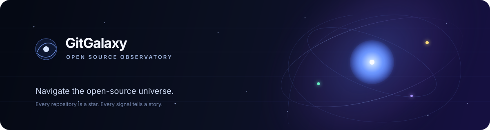
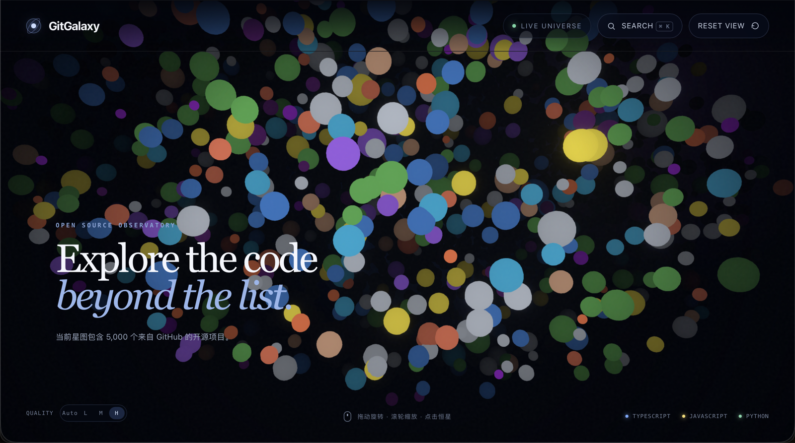

<div align="center">



# 🌌 GitGalaxy

**Explore GitHub as a universe.**

[Live Demo](https://lllirunze.github.io/GitGalaxy/) · [Documentation](docs/README.md) · [Release checklist](docs/v1.0.0/release-checklist.md)

<p>
  <a href="https://github.com/lllirunze/GitGalaxy/actions/workflows/ci.yml"></a>
  
  
  
  
  
  
  
  
</p>

</div>

> GitGalaxy turns public GitHub data into a navigable constellation. Look around, follow a signal, and find the project behind the star.

> [!TIP]
> Press `⌘/Ctrl + K` to search the Universe, then press `Enter` to focus the selected project's star.

Every star represents a GitHub repository. Its size, color, and glow are derived from public signals such as stars, forks, and primary language—making discovery feel less like filtering a list and more like exploring a map.

## ✨ What you can do

| Explore | Discover | Keep it smooth |
|---|---|---|
| Move through a WebGL-powered galaxy of curated repositories. | Search by project, language, description, or topic with `⌘/Ctrl + K`. | Select automatic, low, medium, or high quality for the device in front of you. |
| Read visual signals: scale, color, and glow reflect real project data. | Focus a star, inspect its details, then continue on GitHub. | Fall back gracefully when WebGL is unavailable. |

## 🪐 The universe, at a glance

<div align="center">
  
  <sub>Interactive 3D scene — drag to navigate, scroll to zoom, select a star to inspect its project.</sub>
</div>

| GitHub signal | Visual expression | Why it matters |
|---|---|---|
| Stars | Radius | Helps influential projects emerge from the field. |
| Forks | Glow | Surfaces projects with active downstream adoption. |
| Primary language | Color | Makes the technology landscape readable at a glance. |

## 📡 Current status

GitGalaxy V1.0.0 has completed release validation: the 5,000-record Universe, performance checks, CI, and public Pages deployment have all passed. See the completed [V1.0.0 release checklist](docs/v1.0.0/release-checklist.md).

## 🧩 Tech stack

| Area | Tools |
|---|---|
| Frontend | React, TypeScript, Vite |
| 3D rendering | Three.js, React Three Fiber, Drei, WebGL |
| State and validation | Zustand, Zod |
| Data pipeline | Node.js, GitHub REST API |
| Testing | Vitest, Playwright |
| Delivery | GitHub Actions, GitHub Pages |

## 🚀 Getting started

```bash
pnpm install
pnpm dev
```

Open `http://localhost:5173`.

<details>
<summary><strong>Prerequisites</strong></summary>

- Node.js 24
- pnpm 11
- A modern browser with WebGL enabled

</details>

## ⌨️ Commands

```bash
pnpm test          # Web unit tests
pnpm collect:test  # Collector unit tests
pnpm test:e2e      # Browser interaction tests
pnpm build         # Production build
pnpm lint          # Static checks
pnpm collect       # Fetch GitHub data; requires local .env token
```

## 🛰️ Data collection

Copy `.env.example` to `.env`, supply a GitHub Token locally, and run `pnpm collect`.

> [!CAUTION]
> Never commit `.env`, GitHub Tokens, API keys, or generated credentials. Use `.env.example` as the public template and GitHub Actions Secrets for automation.

Scheduled collection uses the `GH_COLLECTOR_TOKEN` GitHub Actions secret when configured and targets 5,000 repositories by default. The output is validated before it replaces the existing Universe data.

## ⚙️ Automation

GitHub Actions verifies pushes and pull requests, deploys `master` to GitHub Pages, and refreshes Universe data weekly. Configure the repository Pages source as **GitHub Actions**. For scheduled collection, add `GH_COLLECTOR_TOKEN` as a repository secret with the minimum permissions required.

| On every change | Every week | At release |
|---|---|---|
| Run unit, collector, lint, build, and browser checks. | Refresh the 5,000-project Universe and redeploy Pages. | Preserve versioned plans, checklist, release notes, and showcase assets. |

## 📚 Documentation

Each version owns a separate documentation directory. The current release materials are in [`docs/v1.0.0/`](docs/v1.0.0/):

- [Development plan](docs/v1.0.0/development-plan.md)
- [Release checklist](docs/v1.0.0/release-checklist.md)
- [Release notes](docs/v1.0.0/release-notes.md)
- [Documentation versioning policy](docs/README.md)

## 📝 Updates

### v1.0.0 — 2026-10-11

**Release validation complete.**

- The first public release includes 3D exploration, data collection, search, quality modes, CI, and Pages deployment.
- The 5,000-record Universe and performance verification passed the formal release gate.
- See the [release notes](docs/v1.0.0/release-notes.md) and [release checklist](docs/v1.0.0/release-checklist.md).

### v1.0.1 — Planned 2026-10-11

- Replace the default browser tab icon with a GitGalaxy favicon.
- Keep Galaxy density consistent as the Universe grows from 100 to 5,000 repositories.
- Expand the language-color legend to represent every collected primary language.
- See the [V1.0.1 optimization plan](docs/v1.0.1/development-plan.md).

### v1.0.2 — Planned 2026-10-11

- Make initial production rendering show correct star colors without requiring a refresh.
- Collect candidates through bounded, rate-aware concurrency while centrally de-duplicating by Repository ID.
- See the [V1.0.2 optimization plan](docs/v1.0.2/development-plan.md).

## 🤝 Contributing

Please read [CONTRIBUTING.md](CONTRIBUTING.md) before opening an issue or pull request.

## 📄 License

MIT. See [LICENSE](LICENSE).
