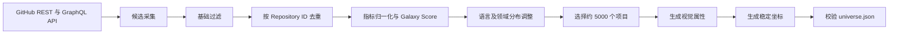
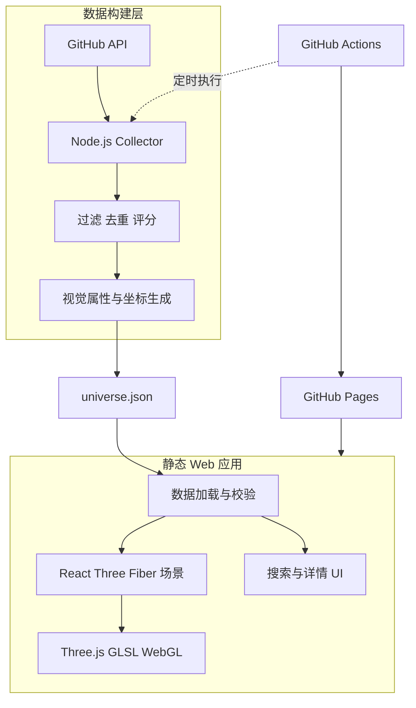

# GitGalaxy V1.0 开发计划

## 文档信息

| 项目 | 内容 |
|---|---|
| 项目名称 | GitGalaxy |
| 首发版本 | V1.0.0 |
| 项目类型 | 开源 Web 应用 |
| 项目定位 | GitHub 优质开源项目的三维宇宙可视化探索平台 |
| 核心技术 | React、TypeScript、Three.js、Node.js |
| 部署方案 | GitHub Pages、GitHub Actions |
| 项目口号 | Explore the Open Source Universe |

本文档是 GitGalaxy V1.0.0 的产品、技术和交付基线。V1.0 的目标不是堆叠功能，而是完成一个可公开访问、可持续更新、具有鲜明视觉体验的开源项目发现产品：用户能够在流畅的三维宇宙中探索约 5,000 个 GitHub Repository，查看项目信息，并通过搜索快速定位项目。

## 1 项目概述

### 1.1 项目背景

GitHub 上有大量优秀的开源项目，但传统发现方式主要依赖关键词搜索、Trending、Star 排序和社区推荐。它们适合寻找明确目标，却不擅长帮助用户探索未知项目，也难以直观呈现项目规模、技术生态和活跃程度。

GitGalaxy 将具有代表性的 GitHub Repository 映射为宇宙中的恒星。用户可以旋转、缩放和移动视角，通过恒星的大小、颜色及光晕了解项目特征，并在点击后查看完整信息。

项目优先保障视觉表现、交互体验和项目发现价值，而不是把 GitHub 排行榜简单转换为三维图形。

### 1.2 V1.0 产品目标

| 目标 | V1.0 交付要求 |
|---|---|
| 三维宇宙 | 渲染具有空间层次感的可交互恒星场景 |
| 项目聚合 | 收录约 5,000 个经过筛选和去重的 Repository |
| 属性可视化 | 将 Star、Fork、主要语言映射为恒星视觉属性 |
| 沉浸式探索 | 支持旋转、缩放、悬停、选择、聚焦和重置 |
| 信息展示 | 展示 Repository 描述、指标、标签和 GitHub 链接 |
| 本地搜索 | 按名称搜索已收录项目并定位对应恒星 |
| 自动更新 | 通过 GitHub Actions 每周更新项目数据 |
| 静态部署 | 通过 GitHub Pages 公开发布，不依赖常驻后端 |

### 1.3 设计原则

- **视觉优先：** 在性能预算内优先做好恒星质感、空间层次、镜头运动和选择反馈。
- **探索优先：** 默认不显示全部 Repository 名称，通过主动选择揭示项目身份。
- **质量优先：** 关注项目影响力、维护状态、活跃度和生态多样性，不追求无意义的数据规模。
- **性能优先：** 所有视觉功能都必须接受真实设备测试，并提供画质降级路径。
- **轻量部署：** Node.js 仅用于本地工具和自动化任务，线上产品保持纯静态架构。
- **渐进交付：** 先形成数据采集、场景探索、信息展示和部署的完整闭环，再增加装饰效果。

## 2 V1.0 功能范围

### 2.1 功能优先级

| 模块 | 功能 | 优先级 | V1.0 状态 |
|---|---|---:|---|
| Universe | 三维宇宙场景 | P0 | 必须交付 |
| Star System | 恒星属性映射和批量渲染 | P0 | 必须交付 |
| Discovery | 点击恒星查看 Repository | P0 | 必须交付 |
| Navigation | 相机控制、聚焦和重置 | P0 | 必须交付 |
| Search | Repository 搜索和定位 | P0 | 必须交付 |
| Data Collector | GitHub 数据采集、筛选和更新 | P0 | 必须交付 |
| Deployment | 自动构建和 GitHub Pages 部署 | P0 | 必须交付 |
| Visual Effects | Bloom、星云、环境粒子 | P1 | 性能允许时交付 |
| Quality Levels | 低、中、高画质分级 | P1 | 建议交付 |
| Filters | 编程语言筛选 | P2 | V1.1 候选 |
| Surprise Me | 随机探索项目 | P2 | V1.1 候选 |

P0 构成 V1.0 发布门槛。P1 不得影响 P0 的稳定性和发布时间；P2 不进入 V1.0 的强制范围。

### 2.2 宇宙场景

Universe 使用全屏三维场景作为主要内容区域，包含以下元素：

| 元素 | 职责 |
|---|---|
| Repository Stars | 对应真实 Repository，可悬停、选择和定位 |
| Background Stars | 纯装饰粒子，不参与搜索或选择 |
| Nebula | 增加空间层次的可选视觉效果 |
| Camera | 处理观察视角、缩放、聚焦和复位 |
| Postprocessing | 在性能预算内提供光晕等后处理效果 |
| UI Overlay | 承载导航、搜索、提示和项目详情 |

基础交互包括鼠标拖拽旋转、滚轮缩放、平滑镜头移动、恒星悬停反馈、点击选择、自动聚焦和返回初始视角。触屏设备提供等价的单指与双指操作。

### 2.3 项目发现闭环

用户点击恒星后，系统应：

1. 标记并高亮目标恒星。
2. 适度降低非目标恒星的视觉权重。
3. 平滑移动相机并聚焦目标。
4. 打开 Repository 信息面板。
5. 提供新标签页打开 GitHub Repository 的入口。

信息面板至少显示项目全名、描述、Star、Fork、主要语言、Topics、最近更新时间和 GitHub 链接。

搜索范围仅限已收录项目。用户选择结果后，系统关闭搜索面板、选择目标恒星、执行镜头定位并展示信息面板。

### 2.4 可访问性与降级

- 键盘可打开搜索、切换搜索结果、关闭面板和重置视角。
- 交互控件有明确的可访问名称和可见焦点。
- 尊重 `prefers-reduced-motion`，减少非必要动画。
- WebGL 不可用时展示说明页和 GitHub 项目入口。
- 移动端减少粒子、后处理与像素比，保证核心发现功能可用。

## 3 恒星视觉系统

### 3.1 数据映射

| GitHub 属性 | 恒星属性 | V1.0 |
|---|---|---|
| Repository ID | 恒星唯一 ID 和稳定坐标种子 | 支持 |
| Stars | 恒星大小 | 支持 |
| Forks | 光晕强度 | 支持 |
| Primary Language | 恒星颜色 | 支持 |
| Galaxy Score | 展示优先级 | 支持 |
| Topics | 分类信息 | 支持 |
| Created At | 项目信息 | 支持 |
| Updated At | 活跃信息 | 支持 |
| Contributors | 周围粒子数 | 后续版本 |
| Trending | 彗星效果 | 后续版本 |

Star 数存在明显的长尾分布，应采用对数归一化计算恒星半径，并对输入与输出设置上下限：

```text
R = Rmin + (Rmax - Rmin)
    × [log(1 + S) - log(1 + Smin)]
    / [log(1 + Smax) - log(1 + Smin)]
```

当最大值等于最小值时直接使用中间半径，避免除零。初始参数建议为 `minRadius = 0.6`、`maxRadius = 3.5`，最终数值以视觉和性能测试结果为准。

### 3.2 语言配色

| 语言 | 颜色 | HEX |
|---|---|---|
| TypeScript | 蓝色 | `#3178C6` |
| JavaScript | 黄色 | `#F7DF1E` |
| Python | 绿色 | `#4CAF50` |
| Rust | 橙色 | `#DEA584` |
| Go | 青色 | `#00ADD8` |
| Java | 红色 | `#E76F51` |
| C++ | 紫色 | `#9B5DE5` |
| C# | 深紫色 | `#68217A` |
| Swift | 橙红色 | `#FA7343` |
| Kotlin | 紫红色 | `#B125EA` |
| Other | 灰白色 | `#B8C0CC` |

颜色映射以 GitHub 返回的主要语言为准。缺少语言信息时使用 Other；颜色不能作为传达类别的唯一手段。

## 4 数据采集与模型

### 4.1 数据来源与规模

数据仅使用 GitHub 官方 REST API 和 GraphQL API，不以网页爬虫作为主要来源。V1.0 目标收录约 5,000 个 Repository，候选池可以按以下方向构建：

| 类别 | 候选目标数量 |
|---|---:|
| 全球高人气项目 | 300 |
| 高人气成熟项目 | 1,500 |
| 不同技术领域优秀项目 | 2,000 |
| 近期活跃及增长项目 | 700 |
| 新兴潜力项目 | 500 |

分类可能重叠，最终数据必须按 Repository ID 去重。GitHub Search API 有单次查询结果限制，Collector 应按 Star 区间、语言或时间范围拆分查询，不能依赖一次查询获取完整候选集。

### 4.2 基础筛选与评分

V1.0 的默认基础条件：

```typescript
const REPOSITORY_FILTER = {
  minStars: 2000,
  excludeArchived: true,
  excludeDisabled: true,
  excludeForks: true,
  requireDescription: true,
};
```

Galaxy Score 初始权重建议为：

```text
G = 0.45S + 0.20F + 0.15A + 0.10C + 0.10N
```

其中 S 为 Star 评分、F 为 Fork 评分、A 为近期活跃度、C 为社区成熟度、N 为近期增长。各指标必须先归一化。无法由当前 API 数据可靠计算的指标不得伪造；例如近期增长需要历史快照，V1.0 可以暂时降低其权重或移除并重新归一化。

候选池采用“全局热门项目 + 语言热门项目 + 技术分类热门项目”的组合，避免单一语言占据绝大多数恒星。

### 4.3 数据处理流程



Collector 必须处理分页、速率与 GraphQL 成本限制、超时和可重试错误、字段缺失、删除或不可访问项目、增量更新以及生成时间记录。失败重试采用退避策略，并设置请求预算与失败阈值。

### 4.4 数据结构

Collector 内部保留完整 Repository 数据，前端只使用渲染和展示所需字段：

```typescript
interface Repository {
  id: number;
  owner: string;
  name: string;
  fullName: string;
  description: string | null;
  url: string;
  stars: number;
  forks: number;
  language: string | null;
  topics: string[];
  createdAt: string;
  updatedAt: string;
  pushedAt: string | null;
  galaxyScore: number;
}

interface GalaxyStar {
  id: number;
  position: { x: number; y: number; z: number };
  appearance: {
    radius: number;
    color: string;
    glowIntensity: number;
  };
  repository: {
    fullName: string;
    description: string | null;
    url: string;
    stars: number;
    forks: number;
    language: string | null;
    topics: string[];
    updatedAt: string;
  };
}
```

生成文件位于 `apps/web/public/data/universe.json`：

```json
{
  "version": "1.0.0",
  "generatedAt": "2026-10-08T00:00:00Z",
  "total": 5000,
  "stars": []
}
```

已有 Repository 的位置必须稳定。优先复用历史坐标；新增项目使用 Repository ID 驱动的确定性算法生成坐标。数据规模继续扩大时，再拆分渲染数据与项目详情数据。

## 5 技术架构

### 5.1 架构决策

V1.0 采用 pnpm Workspace 管理前端、共享类型和 Collector。暂不使用 Turborepo，也不引入常驻服务器、数据库、Redis 或 AI 服务。



### 5.2 技术栈

#### 前端和三维渲染

| 技术 | 用途 | 采用理由 |
|---|---|---|
| React | UI 组件与应用组织 | 生态成熟，适合界面与三维组件协作 |
| TypeScript | 静态类型 | 统一数据模型，降低数据与渲染层错配 |
| Vite | 开发与构建 | 启动快，静态部署配置简单 |
| Three.js | WebGL 渲染核心 | 提供场景、几何体、材质和 GPU 抽象 |
| React Three Fiber | React 三维渲染器 | 用组件模型组织 Three.js 场景 |
| Drei | R3F 辅助能力 | 提供相机控制等常用组件 |
| GLSL | 自定义恒星材质 | 实现批量恒星的光晕与闪烁效果 |
| Zustand | 客户端状态 | 管理选择、搜索和画质状态 |
| Tailwind CSS | UI 样式 | 快速建立一致的界面系统 |
| shadcn/ui | 基础 UI 组件 | 提供可定制、可访问的界面基础 |
| Motion | DOM 界面动画 | 处理面板和搜索界面的过渡 |

#### 数据、质量和部署

| 技术 | 用途 |
|---|---|
| Node.js | Collector、生成器和构建脚本运行环境 |
| GitHub REST API | 搜索和获取 Repository 基础数据 |
| GitHub GraphQL API | 批量获取需要的项目字段 |
| Zod | API 响应、配置和生成数据的运行时校验 |
| pnpm | Workspace 与依赖管理 |
| ESLint | 静态代码检查 |
| Prettier | 代码格式化 |
| Vitest | 评分、归一化、坐标等单元测试 |
| React Testing Library | UI 行为测试 |
| Playwright | 搜索、选择、跳转和部署页面的端到端测试 |
| GitHub Actions | CI、每周数据更新和部署 |
| GitHub Pages | 静态网站托管 |

依赖版本在初始化时锁定，并由 `pnpm-lock.yaml` 统一管理。计划文档不固定具体小版本，以免在正式初始化前写入过时版本。

### 5.3 渲染策略与性能预算

约 5,000 颗 Repository 恒星不得各自创建独立 Mesh。优先使用 `InstancedMesh`，将位置、大小、颜色等作为实例属性传入 GPU。背景星使用 `Points` 合批，不为每颗恒星创建 Point Light。

| 指标 | V1.0 目标 |
|---|---|
| Repository 数量 | 约 5,000 |
| 桌面体验 | 主流独显设备争取稳定 60 FPS |
| 普通笔记本 | 保持流畅操作，无持续性卡顿 |
| 搜索响应 | 本地索引，输入后即时反馈 |
| 场景交互 | 旋转、缩放和聚焦无明显主线程阻塞 |
| 首屏 | 先展示加载状态，再渐进呈现场景 |

画质分为 `low`、`medium`、`high`，可调整背景粒子数量、Bloom、Shader 复杂度、像素比和后处理。性能指标是测试目标，不是未经验证的承诺。

## 6 推荐目录结构

```text
gitgalaxy/
├── apps/
│   └── web/
│       ├── public/data/universe.json
│       ├── src/
│       │   ├── components/{ui,layout,discovery}/
│       │   ├── galaxy/{components,shaders,controls,utils}/
│       │   ├── hooks/
│       │   ├── services/
│       │   ├── stores/
│       │   ├── styles/
│       │   ├── types/
│       │   ├── App.tsx
│       │   └── main.tsx
│       └── package.json
├── packages/
│   └── shared/src/
├── scripts/
│   └── collector/
│       ├── src/{github,filters,scoring,generators}/
│       └── package.json
├── .github/workflows/
│   ├── deploy.yml
│   └── update-universe.yml
├── docs/
├── .env.example
├── .gitignore
├── pnpm-workspace.yaml
├── package.json
├── README.md
└── LICENSE
```

## 7 开发环境与手动安装

本计划不会自动安装以下工具或依赖。开始开发前，请手动准备环境；正式安装时以各工具官方当前稳定版为准。

### 7.1 系统工具

| 工具 | 建议要求 | 检查命令 |
|---|---|---|
| Git | 当前稳定版 | `git --version` |
| Node.js | 当前 Active LTS 或 Maintenance LTS | `node --version` |
| Corepack | 随 Node.js 提供 | `corepack --version` |
| pnpm | 通过 Corepack 启用 | `pnpm --version` |

建议使用 `nvm`、`fnm` 或 Volta 管理 Node.js。启用 pnpm：

```bash
corepack enable
corepack prepare pnpm@latest --activate
```

### 7.2 项目初始化建议

以下命令是下一阶段的参考操作，本次仅记录，不执行：

```bash
pnpm create vite apps/web --template react-ts
pnpm add -C apps/web three @react-three/fiber @react-three/drei zustand zod
pnpm add -C apps/web tailwindcss motion
pnpm add -D eslint prettier typescript vitest @testing-library/react playwright
```

`shadcn/ui` 应在 Tailwind 和路径别名配置完成后，按照其初始化向导手动接入。Three.js 类型是否需要单独安装应以初始化时所选版本的包声明为准。

### 7.3 GitHub 配置

本地 Collector 需要 GitHub Token。所有真实 Token、访问密钥、私钥及其他凭据都属于机密信息，只能保存在本地环境文件或 GitHub Actions Secrets 中，禁止写入源码、配置示例、日志、测试快照和生成数据，禁止提交到 Git 仓库。

本地真实配置写入 `.env`：

```text
GITHUB_TOKEN=实际令牌
```

版本控制规则：

- `.env`、`.env.local`、`.env.*` 等真实环境文件必须由 `.gitignore` 排除。
- `.env.example` 可以提交，用于说明所需变量，但只能包含变量名、用途说明和安全的非机密默认值。
- `.env.example` 中不得出现真实 Token，也不应使用看起来像真实凭据的示例字符串。
- GitHub Actions 使用仓库或环境级 Secrets，例如 `${{ secrets.GITHUB_TOKEN }}`，不得把 Secret 直接写入 Workflow 文件。
- Collector 和 CI 日志不得打印 Token、完整 Authorization Header 或其他凭据。
- 提交前应执行 `git status` 和 `git diff --cached`，确认没有环境文件或凭据进入暂存区。
- 如果凭据被误提交，应立即在 GitHub 撤销或轮换；仅删除 Git 历史中的文本不足以恢复安全。

仓库根目录保留可提交的 `.env.example`：

```text
# GitHub API credential used by the local data collector.
# Copy this file to .env and set the value locally. Never commit .env.
GITHUB_TOKEN=
```

仓库需要开启 GitHub Pages，并为 Actions 配置最小权限。Collector 只通过环境变量读取凭据，不接受硬编码 Token。

## 8 开发阶段与里程碑

整体按单人业余开发约 7 至 10 周规划。三维渲染学习、视觉调试和 GitHub API 配额可能造成波动，因此每个阶段都以交付物和退出条件判断完成，而不是只看日期。

### 阶段一 工程基线 3 至 5 天

主要任务：初始化 pnpm Workspace、React 与 Vite；配置 TypeScript、Tailwind、ESLint、Prettier、Vitest；建立目录和基础 CI；写入环境变量示例。

交付物：应用可启动，CI 能执行检查和测试，页面可显示最小 Three.js 场景。

退出条件：新环境可按照 README 完成安装、运行、测试和构建。

### 阶段二 数据采集 5 至 8 天

主要任务：封装 GitHub API；实现分页、速率限制处理、过滤、去重、基础评分、稳定坐标和 Schema 校验；先用 100 个 Repository 验证，再扩展到约 5,000 个。

交付物：可重复生成符合 Schema 的 `universe.json`。

退出条件：无重复 ID、必需字段有效、同一 ID 多次生成坐标一致，失败有可诊断日志。

### 阶段三 三维宇宙 8 至 12 天

主要任务：建立场景、背景星空和 Repository 恒星；实现属性映射、`InstancedMesh`、相机控制、射线选择和基础性能采样。

交付物：用户可浏览并选择约 5,000 颗恒星。

退出条件：桌面目标设备交互流畅，恒星与数据一一对应，无明显内存持续增长。

### 阶段四 交互与 UI 5 至 8 天

主要任务：实现导航、加载状态、详情面板、搜索、定位、镜头聚焦、响应式布局、键盘操作和错误状态。

交付物：形成从探索或搜索到查看项目再到打开 GitHub 的完整路径。

退出条件：核心流程在桌面和移动端均可完成，键盘可以操作主要功能。

### 阶段五 视觉与性能 7 至 12 天

主要任务：优化 Shader、光晕、Bloom、背景粒子、星云、镜头动画和界面视觉；实现画质分级与 reduced motion；用浏览器性能工具建立测试记录。

交付物：形成稳定且可识别的 GitGalaxy 视觉风格。

退出条件：低画质仍保留核心体验，高画质效果不会遮挡项目选择或导致严重掉帧。

### 阶段六 测试与发布 5 至 8 天

主要任务：单元、组件和 E2E 测试；跨浏览器检查；配置数据更新与部署 Actions；补充 README、贡献指南、License、截图及 15 至 30 秒演示素材。

交付物：公开可访问的 GitGalaxy V1.0.0。

退出条件：所有 P0 验收项通过，生产构建和部署可复现，Release Notes 已发布。

## 9 测试与验收标准

### 9.1 测试策略

- **单元测试：** 归一化、评分、颜色映射、稳定坐标、过滤和去重。
- **Schema 测试：** API 输入和生成 JSON 的字段、范围、唯一性及 URL 合法性。
- **组件测试：** 搜索、详情面板、错误状态与键盘交互。
- **E2E 测试：** 加载宇宙、搜索定位、点击恒星、打开 Repository 和重置视角。
- **视觉检查：** 桌面、笔记本和移动视口下检查布局和遮挡。
- **性能测试：** 记录帧率、Draw Call、内存、加载体积和长任务，而不是凭主观判断。

### 9.2 V1.0 发布验收

| 模块 | 验收标准 |
|---|---|
| 数据采集 | 能生成约 5,000 个符合规则的 Repository |
| 数据质量 | ID 无重复，必需字段完整并通过 Schema 校验 |
| 数据稳定性 | 已有 Repository 更新后坐标保持不变 |
| 宇宙场景 | Repository 恒星渲染正确，装饰星不可选 |
| 属性映射 | 大小、颜色和光晕与源数据规则一致 |
| 相机控制 | 支持旋转、缩放、聚焦、边界限制和重置 |
| 项目交互 | 悬停与点击反馈明确，选择状态一致 |
| 项目详情 | 正确展示规定字段和 Repository 链接 |
| 搜索 | 能搜索已收录项目并定位目标恒星 |
| 降级能力 | 低画质、reduced motion 和 WebGL 错误状态可用 |
| 性能 | 目标设备无持续性卡顿，指标有记录可复核 |
| 自动化 | CI 检查、测试、构建、数据更新和部署正常 |
| 部署 | GitHub Pages 可公开访问，Vite base path 正确 |
| 开源材料 | README、LICENSE、贡献说明和演示素材完整 |

## 10 自动化更新与发布

### 10.1 数据更新

V1.0 默认每周更新一次，并保留手动触发。流程为：采集 GitHub 数据、过滤与评分、复用已有坐标、生成新项目坐标、Schema 校验、运行测试、构建并部署。

更新失败时不得覆盖上一份有效数据。自动提交数据变更前，应输出新增、移除和变更数量摘要。Token 遵循最小权限原则。

### 10.2 工作流职责

- `deploy.yml`：安装锁定依赖、Lint、测试、生产构建、部署 GitHub Pages。
- `update-universe.yml`：定时或手动运行 Collector、校验结果并更新数据，再触发部署。

Vite 部署到项目级 GitHub Pages 时，需要将 `base` 设置为仓库路径，例如 `/gitgalaxy/`；实际值以最终仓库名称为准。

### 10.3 发布材料

英文 README 至少包括项目介绍、演示、Live Demo、Features、Tech Stack、Getting Started、How It Works、Data Collection、Development、Roadmap、Contributing 和 License。V1.0 Release 同时提供截图及 15 至 30 秒的演示 GIF 或短视频。

## 11 风险与应对

| 风险 | 影响 | 应对方案 |
|---|---|---|
| GitHub API 与搜索限制 | 采集不完整或任务失败 | 拆分查询、缓存、增量更新、退避重试和请求预算 |
| 三维渲染性能不足 | 掉帧、发热、移动端不可用 | Instancing、合批、画质分级、像素比限制和性能门禁 |
| 数据质量偏差 | 热门但失活或生态单一 | 多维评分、归档过滤、分类采样、分布控制和人工抽检 |
| 视觉开发挤压核心功能 | 延迟发布且产品不可用 | 严守 P0 门槛，视觉增强以可关闭模块实现 |
| 更新导致星图漂移 | 用户空间认知被破坏 | 复用历史坐标，新增项目使用 ID 确定性生成 |
| 静态 JSON 过大 | 首屏加载变慢 | 压缩、按需字段、缓存，必要时拆分详情数据 |
| 浏览器或 WebGL 差异 | 局部设备黑屏或效果异常 | 跨浏览器测试、能力检测和友好降级页面 |
| Token 泄漏 | 安全风险和额度滥用 | `.gitignore`、Secrets、最小权限和日志脱敏 |

## 12 后续版本路线

V1.0 是首个公开稳定版本，后续版本从 V1.1 延续，不再使用 V0.x：

| 版本 | 候选方向 |
|---|---|
| V1.1 | 语言筛选、颜色图例、随机探索 |
| V1.2 | 按技术领域划分 Galaxy |
| V1.3 | Trending 数据与彗星效果 |
| V1.4 | 项目增长趋势可视化 |
| V1.5 | 个人 GitHub Universe |
| V1.6 | 截图、分享链接与探索历史 |
| V2.0 | 个性化发现、可扩展数据源与更大规模宇宙 |

具体版本内容由用户反馈、维护成本和技术验证结果决定，不承诺固定发布日期。

## 13 V1.0 完成定义

GitGalaxy V1.0.0 的完成标准是：用户打开公开网址后，能够在合理加载时间内进入三维宇宙，以流畅的方式浏览约 5,000 个经过筛选的开源项目，通过探索或搜索选中恒星，准确查看 Repository 信息并访问 GitHub；维护者能够使用可复现的命令测试、构建、更新数据和部署项目。

最终技术组合为 React、TypeScript、Vite、Three.js、React Three Fiber、GLSL、Node.js、GitHub API、GitHub Actions 和 GitHub Pages。V1.0 不引入常驻服务器和数据库，开发重点依次是完整闭环、稳定性能、视觉品质与开源协作体验。
